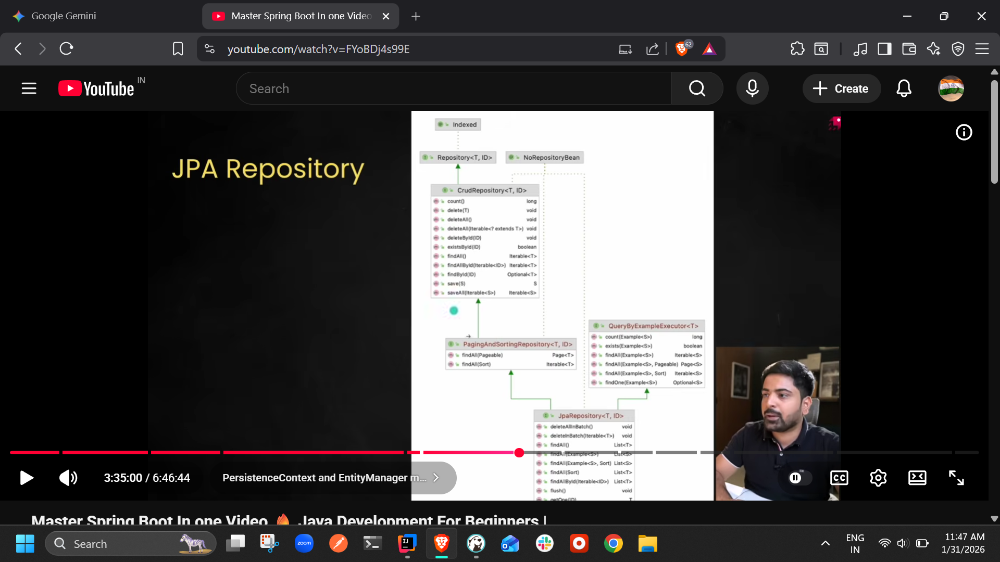
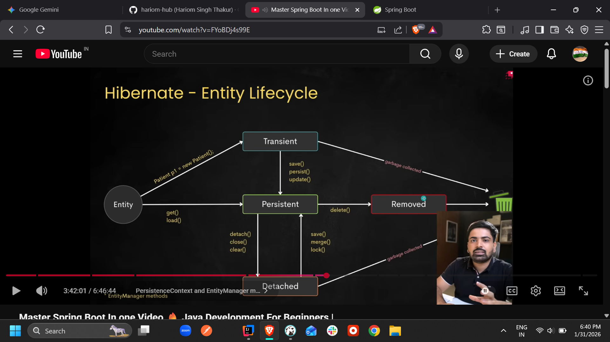
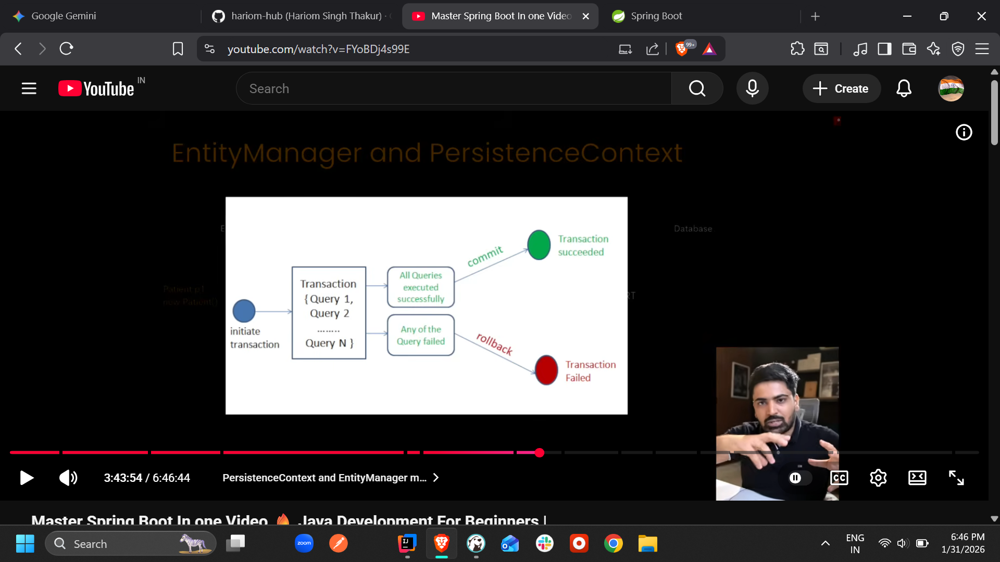
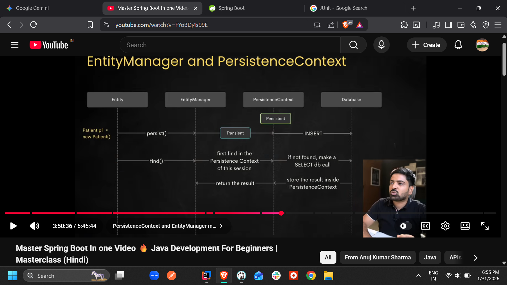
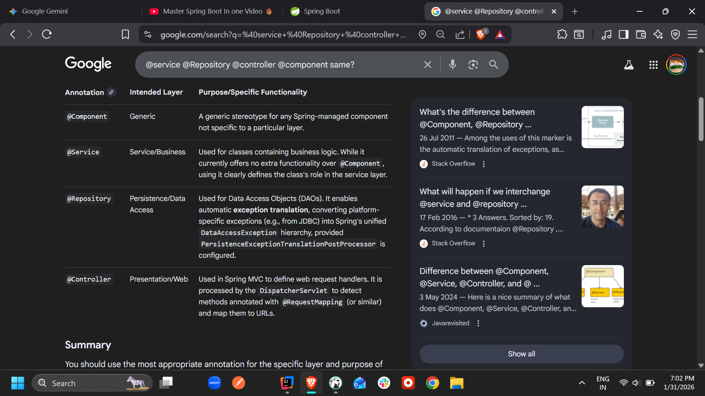
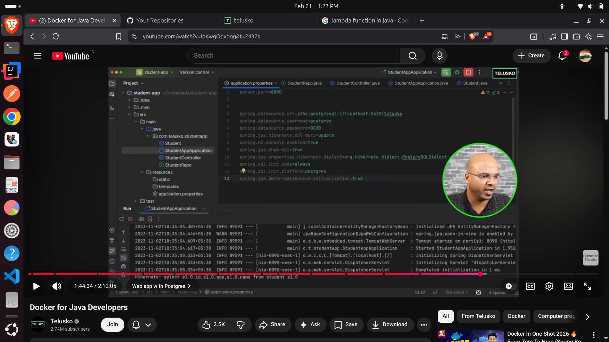

# Learnings 

Persistance Context - First level Cache

@Autowired - Annotation used in the contribution of injecting beans into a class.

## Points to remember from images 

## references = https://github.com/hariom-hub/restful-api-s-in-spring-boot
### spring.data.jpa.hibernate.ddl-auto = update/validate/none/create/create-drop
#### none = Does nothing. No changes are made to the database.,Production
#### validate = "Checks if the tables/columns match your entities. If not, the app fails to start.",Production / Staging
#### update = Only adds new columns or tables. It will not remove columns or change data types.,Development
#### create = Drops existing tables and creates new ones every time the app starts.,Testing
#### create-drop = Same as create, but also drops the tables when the app shuts down.

Let's move forward with the project with Docker containerization. "let's move forward"
Today I will be completing  the Entity Relation model of BloodBuddy.
