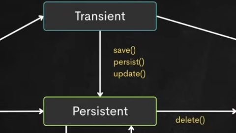
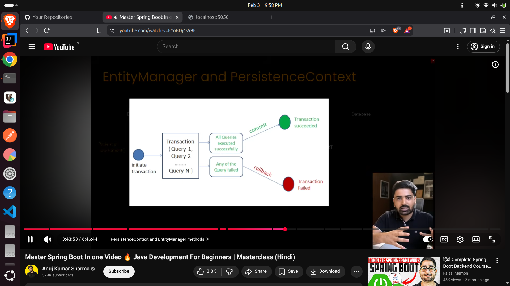

| Method      | Use                   |
| ----------- | --------------------- |
| `persist()` | New entity save       |
| `save()`    | Hibernate specific    |
| `update()`  | Detached → Persistent |
| `remove()`  | Delete from DB        |

## Learn JPA Query Methods